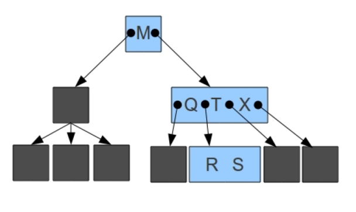

# **Exercícios sobre Árvore B**
## **1) Por que o número de filhos, ou grau, de um nó de uma árvore B qualquer não pode ser igual a 1?** 
De acordo com os autores Bayer e McCreight, dentre outros, definem a ordem como sendo o número mínimo de chaves que uma página pode conter, mas essa definição pode causar ambiguidades quando se quer armazenar um número máximo ímpar de chaves. Assim, para evitar a ambiguidade, Knuth propôs que a ordem de uma árvore B fosse o número máximo de páginas filhas que toda página poderia conter. Dessa forma, o número máximo de chaves por página ficou estabelecido como a ordem menos um, que também foi usado para as outras partes da árvore B.
## **2) Para que valores de ordem da árvore da figura abaixo é uma árvore B válida?**

A árvore representada acima possui as seguintes características:
- Grau mínimo: $2$;
- Número mínimo de chaves por nó (menos a raiz): $2$;
- Número máximo de chaves por nó: $3$;
- Número máximo de filhos por nó: $4$;

As regras gerais para a construçao de uma Árbore B sao:
- Grau mínimo: $d/2$;
    
    Para um grau mínimo = $2$, a ordem precisaria ser $4$ ou $5$.

- Número mínimo de chaves por nó (menos a raiz): $d/2 - 1$;

    Considerando apenas os valores apresentados na imagem, para um mínimo de $2$ chaves por nó, seria necessário uma ordem de $6$ ou $7$, o que invalidaria o grau mínimo de $2$ encontrado anteriormente, que passaria a ser $3$. 
    
    Como na imagem claramente o grau mínimo da árvore é $2$, vamos considerar que existe algum nó na árvore com grau mínimo $1$, porém só nao foi apresentado.

    Assim sendo, as ordens válidas continuam sendo $4$ ou $5$.
    
- Número máximo de chaves por nó: $d - 1$;

    Para o número máximo de chaves apresentado na imagem = $3$, a ordem que satisfaz a propriedade é somente a ordem $4$.

- Número máximo de filhos por nó: $d$;

    Para o númer o máximo de filhos apresentado na imagem = $4$, a única ordem que satisfaz a propriedade é a ordem $4$.

Desse modo, a ordem que satisfaz todas essas regras para a árvore representada acima é a ordem $4$;

## **3) Mostre todas as árvores B válidas de ordem d = 1 que possuem as seguintes chaves {1,2,3,4,5}.**

Não podemos ter raíz de chave 1, já que não terá dois filhos, pois todos os outros números são maiores que 1 e ficará apenas com um filho direito que terá outros filhos. Com isso, as folhas não ficarão no mesmo nível, quebrando a definição da árvore B. Também não podemos ter raíz de chave 5, pelos mesmos motivos da chave 1, sendo considerado o filho esquerdo da raíz.

As possibilidades estarão na imagem

## **4) Explique como encontrar a maior chave armazenada em uma árvore B.**
Para encontrar a maior chave, o primeiro passo é verficar se a maior chave da página raiz possui uma ponteiro para uma outra página, caso tenha, repetir o mesmo passo para a página atual, e assim sucessivamente até que seja encontrado uma chave que não possui um ponteiro. Dessa forma, essa chave é a maior chave da árvore B.

## **5) Desenhe, passo a passo, uma árvore B de ordem d = 2 inserindo as seguintes chaves na ordem em que estão sendo informadas: 99, 50, 60, 37, 45, 15, 28, 40, 58, 89, 70, 65, 59,48, 49, 53.** 

## **6) Sobre a árvore resultante do exercício anterior, ilustre, passo a passo, as seguintes operações:**
* a) Inserir, também na ordem em que são informadas, as chaves 47, 46, 39, 52, 51, 55 (notar que as inserções são cumulativas).
* b) Sobre o resultado do passo (a), excluir as chaves 37, 47, 46 e 65, na ordem informada. Notar que as exclusões são cumulativas.
